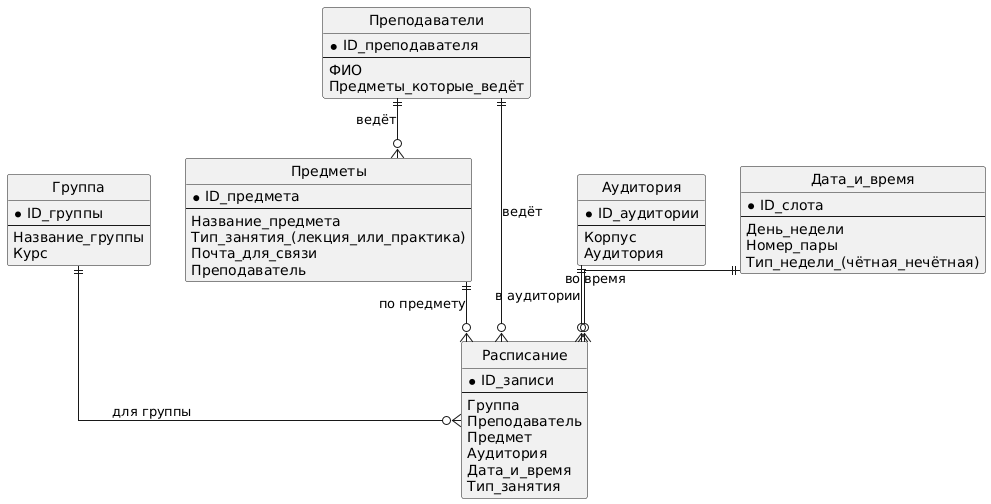

# animated-couscous
# Система управления расписанием

Данный проект представляет собой упрощённую модель системы расписания университета.  
Система позволяет работать с расписанием трём ролям: администратору, преподавателю и студенту.

## Основная функциональность

### Администратор
- Выбор записи в расписании.
- Изменение даты, времени, аудитории и преподавателя.
- Проверка пересечений расписания.
- Сохранение изменений или вывод ошибки.

### Преподаватель
- Выбор даты.
- Просмотр своих занятий на выбранный день.
- Получение результата: расписание найдено или отсутствует.

### Студент
- Выбор группы, даты или преподавателя.
- Просмотр подходящих занятий.
- Получение результата: расписание показано или отсутствует.

## Диаграммы

Все диаграммы и файлы PlantUML находятся в папке:  
[diagrams/](diagrams/)

- usecase.puml / usecase.png
- activity_admin.puml / activity_admin.png
- activity_teacher.puml / activity_teacher.png
- activity_student.puml / activity_student.png

## ER-диаграмма базы данных

## Скриншоты

Скриншоты выполнения работы — в папке:  
[screenshots/](screenshots/)
